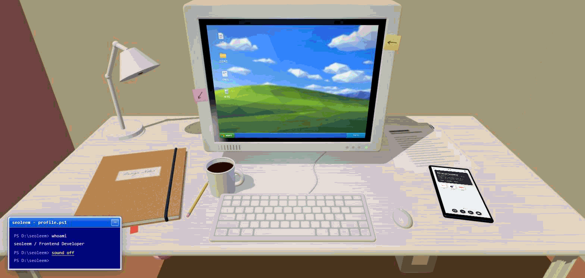
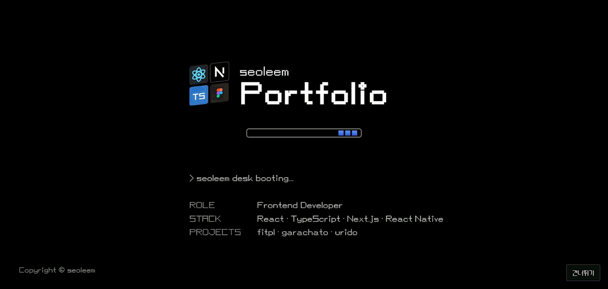
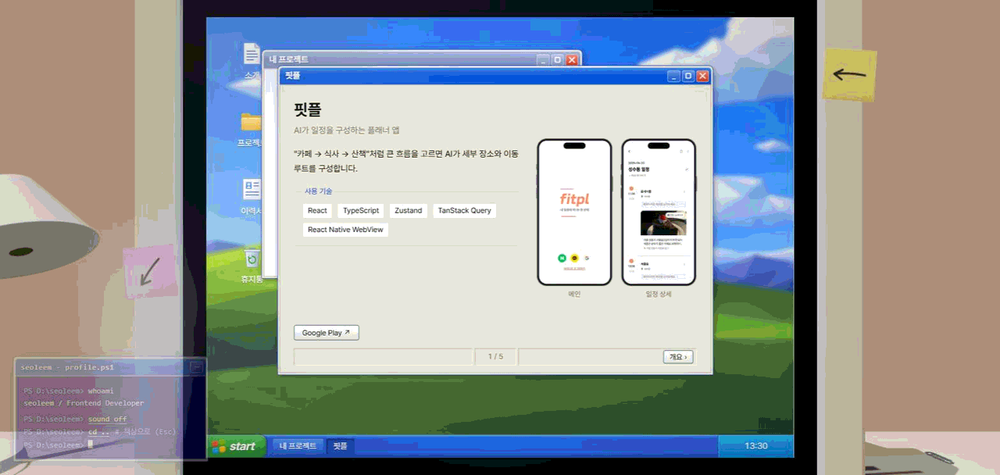
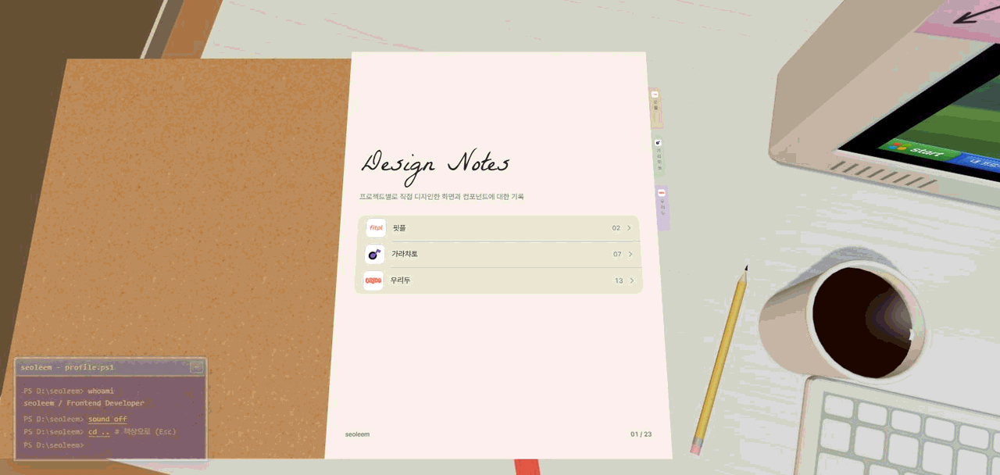

# seoleem portfolio

프론트엔드 개발자 이서림의 포트폴리오입니다.

배포: https://seoleem-portfolio.vercel.app



## About

Windows XP 부팅 화면에서 시작해 3D 책상으로 이어지는 인터랙티브 포트폴리오입니다.
책상 위 물건이 각각 하나의 화면을 맡습니다. 모니터는 개발 판단(프로젝트 창, 소개, 휴지통), 공책은 디자인 작업, 핸드폰은 연락과 외부 링크, 서류는 이력서 PDF 열람입니다.

## Preview

### Boot



Windows XP 부팅 화면을 모티브로 한 진입 화면입니다. 직함, 주력 스택, 프로젝트 목록을 먼저 보여 줍니다.

### Portfolio UI



모니터 안은 XP 창으로 짠 UI입니다. 프로젝트마다 소개 → 서비스 구조 → Engineering Case 순서로 장을 넘기며 읽습니다.

### Design Notes



공책은 Figma에서 직접 디자인한 화면과 컴포넌트를 모은 곳입니다. 표지 목차나 옆의 인덱스 탭을 누르면 그 프로젝트의 장으로 넘어갑니다.

## 주요 구현

* **3D 오브젝트 위에 실제 DOM을 얹은 화면**
  * 모니터·공책·서류 화면을 캔버스 텍스처가 아니라 DOM으로 그려, 멀리서 본 모습과 확대한 모습이 항상 같은 코드에서 나옵니다.
  * 3D 변환 안에서는 브라우저가 앞뒤 면을 거꾸로 판정해 `backface-visibility`를 쓸 수 없습니다. 공책은 넘김 진행도로 어느 면을 보일지 직접 정하도록 했습니다.

* **필요할 때만 그리는 렌더 루프**
  * 확대 상태에서는 프레임 루프를 멈추고 변화가 있을 때만 다시 그립니다.
  * 그림자 맵은 조명이나 물건이 실제로 움직였을 때, 초당 20번까지만 갱신합니다. 오브젝트를 끄는 동안 매 프레임 다시 그리면 그때만 눈에 띄게 버벅였습니다.

* **화면 비율에 맞춰 스스로 잡히는 카메라**
  * 확대 구도를 좌표로 적지 않고 "무엇을 얼마나 담을지"로 적어, 창 크기가 달라져도 대상이 같은 비율로 들어옵니다.
  * 세로로 긴 화면에서는 뒤로 물러나는 대신 시야각을 넓힙니다. 물러나면 카메라가 방 밖으로 나가 벽 너머가 드러나기 때문입니다.

* **한 벌의 UI를 데스크톱과 모바일에서 다르게 세우기**
  * 모니터 창은 데스크톱에서는 겹쳐 쓰는 XP 창, 좁은 화면에서는 3D 밖 모달로 뜹니다. 내용 컴포넌트는 그대로 두고 껍데기만 바꿉니다.
  * 색과 간격은 화면별로 나눈 CSS 변수(사이트 공통 / XP / 폰)로 관리합니다.

* **상태를 역할별로 나눈 구조**
  * 씬 상태(전원, 확대 대상, 카메라 요청)와 창 상태(열림, 겹침 순서, 읽던 장)를 zustand 스토어 둘로 나눴습니다.
  * 창은 모니터 밖(핸드폰 앱 타일)에서도 열리기 때문에 컴포넌트 상태로 두지 않았습니다.

## Tech Stack

| Category  | Stack                             |
| --------- | --------------------------------- |
| Framework | Next.js 16 (App Router)           |
| Language  | TypeScript                        |
| UI        | React 19                          |
| Styling   | Tailwind CSS 4, CSS Variables     |
| 3D        | three, React Three Fiber, drei    |
| State     | Zustand                           |

> 전체 패키지와 버전은 `CLAUDE.md`에서 확인할 수 있습니다.

## 실행

```bash
npm install
npm run dev
```

로컬 환경에서 아래 주소로 접속합니다.

```text
http://localhost:3000
```

검증은 아래 세 가지로 합니다.

```bash
npm run typecheck
npm run lint
npm run build
```

## 브랜치와 배포

| 브랜치 | 역할 | 배포 |
| --- | --- | --- |
| `main` | 배포본 | Vercel 프로덕션 |
| `dev` | 통합. 저장소 기본 브랜치 | 미리보기 |
| `feat/*`, `fix/*` | 작업 | 미리보기 |

작업 브랜치에서 올리는 PR의 base는 `dev`입니다. `dev`에서 확인이 끝나면 `main`에 머지해 배포합니다.
커스텀 도메인은 아직 붙이지 않았습니다(`docs/log/decision-backlog.md` B08). 도메인을 붙이면 Vercel 환경 변수 `NEXT_PUBLIC_SITE_URL`에 넣습니다. 공유 카드의 절대 주소가 이 값에서 나옵니다.

## Documentation

| 문서 | 내용 |
| --- | --- |
| `CLAUDE.md` | 프로젝트 개발 규칙 및 Claude Code 작업 컨텍스트 |
| `docs/content-brief.md` | 화면별 콘텐츠 명세. 무엇을 어디에 얼마나 넣을지 |
| `docs/commit-convention.md` | 커밋 메시지 컨벤션 |
| `docs/code-review.md` | 코드 리뷰 절차 및 리뷰 리포트 양식 |
| `docs/log/decision-backlog.md` | 보류한 결정과 후속 처리 경로 |
| `docs/log/` | 개발 사이클 회고 기록 |
